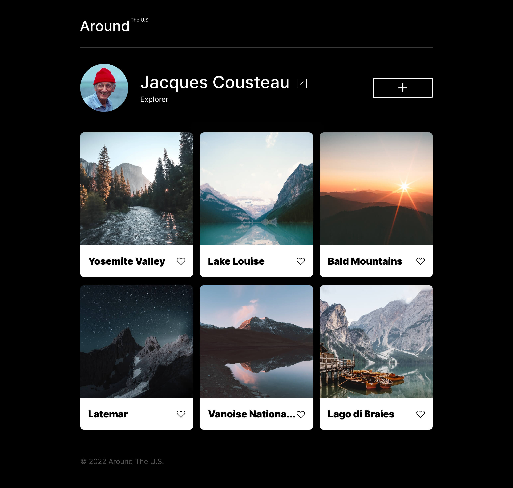
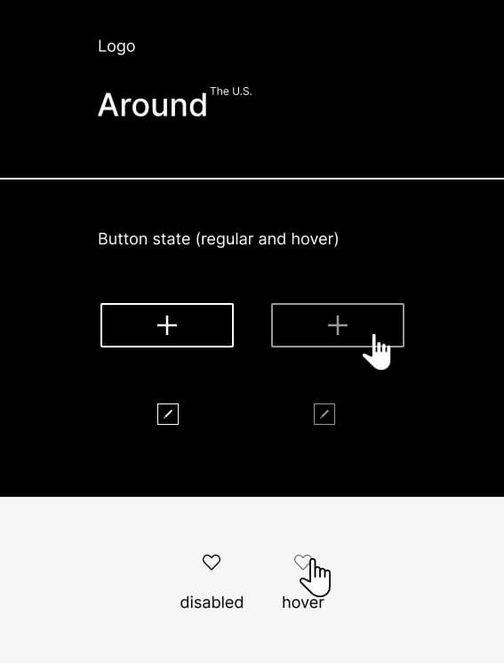

# Project 3: Around The U.S.

This is project 3 for the TripleTen Software Engineer program. In this project we created a web page titled "Around the U.S." This is an interactive webpage where users can personalize a profile by making small changes, such as adding or removing pictures as well as adding their name and a title or breif description.

## Site Link

https://zchabot.github.io/se_project_aroundtheus/

## Project Features

- Semantic HTML5
- Flexbox
- Grid layout
- Responsive design for different screen sizes
- Media queries

## Demo

### Images

### Video Link

https://drive.google.com/file/d/1wn2gnj1LEAvECHiUe4kr7ypE0kn3hYf-/view?usp=drive_link

## Improvements

At this stage of the project we do not have working buttons that allow us to add information as described. I know we will be building on this project over the next few sprints so I am assuming we will be adding these functions in. I think another improvement would be enlarging the pictures when selected or hovered using transition:scale on modifiers such as :hover.
